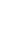
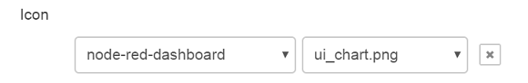
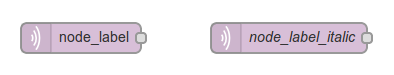
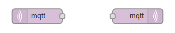
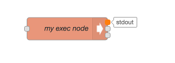
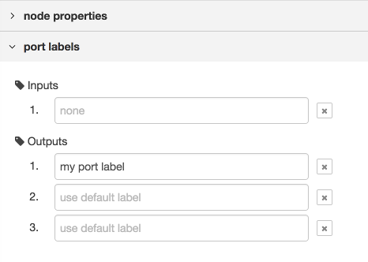
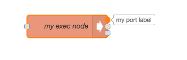

ノードの見た目として、
アイコン、背景色、ラベルの3点を変更できます。

### アイコン

ノードのアイコンは、定義内のthe `icon` プロパティに指定します。

プロパティの値は、文字列または関数を設定できます。

プロパティの値が文字列の場合は、その文字列をアイコン名として扱います。

プロパティの値が関数の場合は、ノードが最初に読み込まれた時、またはノードが編集された後に評価されます。関数はアイコン名として使う文字列を返すようにしてください。
関数は、ワークスペース上のノード（`this` が参照するノードインスタンス）と、パレット上のノードの両方のアイコンを表示するために使用されます。
パレット上のノード向けの場合、 `this` は特定のノードインスタンスを参照しません。
関数は有効な値を返す *必要があります。*

                ...
                icon: "file.png",
                ...

用意されたアイコン、またはノードと一緒に提供されるアイコンを利用できます。

#### 用意されたアイコン

<ul class="nr-icon-list">
<li> alert.png</li>
<li> arrow-in.png</li>
<li> bridge-dash.png</li>
<li> bridge.png</li>
<li> db.png</li>
<li> debug.png</li>
<li> envelope.png</li>
<li> feed.png</li>
<li> file.png</li>
<li> function.png</li>
<li> hash.png</li>
<li> inject.png</li>
<li> light.png</li>
<li> serial.png</li>
<li> template.png</li>
<li> white-globe.png</li>
</ul>

#### 独自アイコン

ノードの `.js` ファイルや `.html` ファイルと同じディレクトリに存在する `icons` ディレクトリの中に、ノード固有の独自アイコンを配置します。
アイコンのファイル名を指定すると、エディタは本ディレクトリ内からアイコンを探し出します。
そのため、アイコンのファイル名は一意にする必要があります。

アイコンは、背景を透過色にした20 x 30 ピクセルの白い画像にしてください。

#### ユーザ定義アイコン

Node-RED 0.18版以降、ノードのアイコンは設定エディタの`node settings`を利用することで上書きできるようになりました。

    

1つもしくは複数のアイコンファイルを含むインストール済のモジュール名または`node-red`のコアノードの名称が左に表示されます。モジュールのアイコンファイルの名前が右に表示されます。

<b>注意</b>: ノードがデフォルトの`icon`プロパティを持っている場合、ノードのアイコンは上書きすることができません（例 ui_button node of node-red-dashboard）。

### 背景色

ノードの背景色は、異なるノードの型を素早く区別するための主な手段の1つです。
ノードの背景色は、ノード定義の `color` プロパティに定義してください。


...
color: "#a6bbcf",
...


Node-REDでは落ち着いた色を採用しています。 
新たなノードは、この色に合うようにしてみてください。

以下は、ノードの背景色として良く使われる色です。:

<ul class="nr-color-list">
<li style="background: #3FADB5">#3FADB5</li>
<li style="background: #87A980">#87A980</li>
<li style="background: #A6BBCF">#A6BBCF</li>
<li style="background: #AAAA66">#AAAA66</li>
<li style="background: #C0C0C0">#C0C0C0</li>
<li style="background: #C0DEED">#C0DEED</li>
<li style="background: #C7E9C0">#C7E9C0</li>
<li style="background: #D7D7A0">#D7D7A0</li>
<li style="background: #D8BFD8">#D8BFD8</li>
<li style="background: #DAC4B4">#DAC4B4</li>
<li style="background: #DEB887">#DEB887</li>
<li style="background: #DEBD5C">#DEBD5C</li>
<li style="background: #E2D96E">#E2D96E</li>
<li style="background: #E6E0F8">#E6E0F8</li>
<li style="background: #E7E7AE">#E7E7AE</li>
<li style="background: #E9967A">#E9967A</li>
<li style="background: #F3B567">#F3B567</li>
<li style="background: #FDD0A2">#FDD0A2</li>
<li style="background: #FDF0C2">#FDF0C2</li>
<li style="background: #FFAAAA">#FFAAAA</li>
<li style="background: #FFCC66">#FFCC66</li>
<li style="background: #FFF0F0">#FFF0F0</li>
<li style="background: #FFFFFF">#FFFFFF</li>
</ul>

### ラベル

ノードのラベルについては、 `label` 、 `paletteLabel` 、 `outputLabel` 、 `inputLabel`　の4つのプロパティがあります。

#### ノードラベル

ワークスペース内のノードの `label` は静的なテキストにもできますし、
各ノード毎のプロパティに基づき動的に設定することもできます。

プロパティに設定できる値は文字列または関数です。

値が文字列の場合は、それがそのまま使用されます。

値が関数の場合は、ノードが最初にロードされたタイミング、またはノードが編集された段階で評価されます。
関数の戻り値がラベルとして使用されます。

前のセクションで言及したとおり、それぞれのノードを区別しやすくするため `name` プロパティを持っています。
下記の例は `label` にプロパティまたはデフォルト値がセットされることを表しています。


...
label: function() {
    return this.name||"lower-case";
},
...


プロパティの [クレデンシャル](credentials) はラベルの関数内では使用できません。

#### パレットラベル

標準では、ノードの型をパレット上のノード名として使います。
`paletteLabel` プロパティを指定すると、標準のノード名を上書きします。

`label` と同様に、プロパティは文字列または関数とします。
関数の場合は、ノードがパレットに追加されたとき1回評価されます。

#### ラベルスタイル

ラベルのCSSは `labelStyle` を利用して動的に設定できます。
現状では、このプロパティは適用するCSSクラスを特定できなければいけません。
指定されていない場合は、デフォルトの `node_label` が指定されます。
他にあらかじめ定義されているクラスは `node_label_italic` のみです。

    

下記は `name` プロパティが設定されている場合に、 `labelStyle` に `node_label_italic` を設定する例です。


...
labelStyle: function() {
    return this.name?"node_label_italic":"";
},
...


#### 位置合わせ

デフォルトでは、アイコンとラベルはノード内の左寄せになっています。
フローの最後となるノードの場合は、慣例では右寄せにします。
これをノードの `align` プロパティに `right` を設定することにより実現します。


...
align: 'right',
...


    

#### Port labels

Node-RED バージョン **0.17** 以降では、オプションとして
ノードのラベルに入力ポートと出力ポートを設定することができ、
ポートにマウスオーバーすることにより表示されます。

    

これらはノードのhtmlファイルへ静的に設定できます。

    ...,
    inputLabels: "parameter for input",
    outputLabels: ["stdout","stderr","rc"],
    ...

関数の場合は、出力ピンの位置が得られます（indexは0から始まります）。

    ...,
    outputLabels: function(index) {
        return "my port number "+index;
    }
    ...

どちらの場合でも、設定エディタの `node settings` でユーザーが値を設定すると上書きされます。

    

    

<b>注意</b>: ラベルは動的には生成されず、 `msg` プロパティで設定することもできません。
