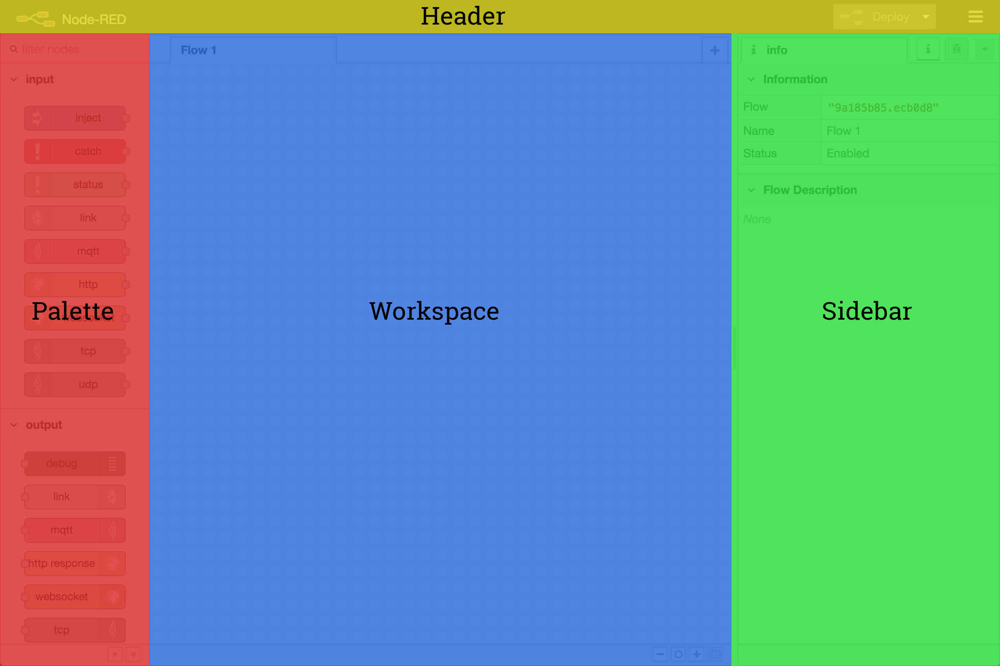

  
  
エディタウィンドウ

  
  
エディタ構成要素

エディタウィンドウは4つの構成要素から成っています。:

 - ヘッダは上部に存在し、デプロイボタン、メインメニュー、 
   またユーザ認証を有効にしていればユーザメニューが含まれます。
 - [パレット](palette)は左側に存在し、利用可能なノードが含まれます。
 - メインである[ワークスペース](workspace)は中央に存在し、フローの作成をここでおこないます。
 - [サイドバー](sidebar)は右側に存在します。
