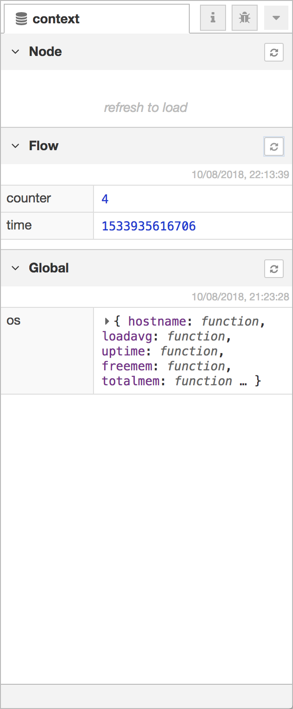

  
  
コンテキストデータサイドバー

コンテキストデータサイドバーはコンテキストデータストアの中身を表示します。

コンテキストの使い方についての更なる情報は、[コンテキストを利用する](/docs/user-guide/context)ガイドを参照してください。

<table class="action-ref inline">
 <tr><th colspan="2">リファレンス</th></tr>
 <tr><td>動作</td><td><code>core:show-context-tab</code></td></tr>
 <tr><td>ショートカットキー</td><td><code>Ctrl/⌘-g x</code></td></tr>
</table>

パネルは、各コンテキストスコープに応じた3つのセクションに分かれています。

「Node」セクションは、現在選択されているノードのコンテキストを表示します。
この内容は自動的には表示されないため、
ロードをおこなうためにはユーザが更新ボタンをクリックする必要があります。

「Flow」セクションは現在のフローのコンテキストを表示します。
ワークスペースのフローが変更されるたびに自動的に更新されます。

「Global」セクションはグローバルコンテキストを表示し、
エディタが読み込まれるたびにロードされます。

3つのセクションすべてにおいて、変更を確認するためにはそれぞれに対応した更新ボタンをクリックします。

コンテキストプロパティの名称にマウスをホバーすると、
1つの値だけを更新するための更新ボタンが表示されます。

コンテキストプロパティの値にマウスをホバーすると、
その内容をクリップボードへコピーするボタンが表示されます。
値はJSONに変換されるため、すべての値がコピーされるわけではありません。
