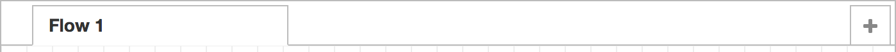
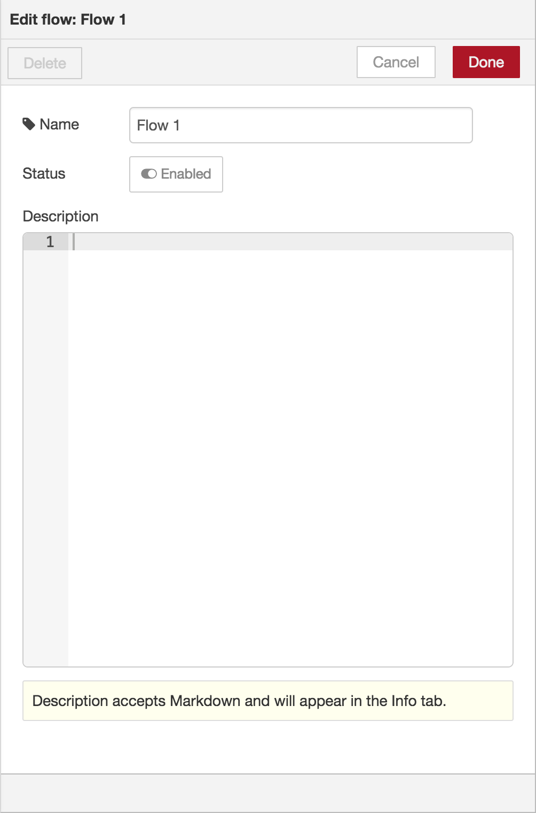

  
  
フロータブ

#### フローを追加する

フローを追加するには、
上部バーの<i style="border-radius: 2px; display:inline-block;text-align:center; width: 30px; color: #777; border: 1px solid #777; padding: 6px;" class="fa fa-plus"></i>ボタンをクリックします。

<table class="action-ref inline">
 <tr><th colspan="2">リファレンス</th></tr>
 <tr><td>ショートカットキー</td><td><i>なし</i></td></tr>
 <tr><td>メニューオプション</td><td><code>フロー -&gt; フローを新規追加</code></td></tr>
 <tr><td>動作</td><td><code>core:add-flow</code></td></tr>
</table>

#### フロープロパティを編集する

  
  
フロープロパティエディタ

フローのプロパティを編集するには、上部バーのタブをダブルクリックします。
この操作でフロープロパティダイアログが開きます。

<table class="action-ref inline">
 <tr><th colspan="2">リファレンス</th></tr>
 <tr><td>ショートカットキー</td><td><i>なし</i></td></tr>
 <tr><td>メニューオプション</td><td><code>フロー -&gt; フロー名を変更</code></td></tr>
 <tr><td>動作</td><td><code>core:edit-flow</code></td></tr>
</table>

ダイアログ内では、フロー名と詳細を設定できます。
詳細は整形のためにMarkdownシンタックスを利用することができ、[情報サイドバー](../sidebar/info)に表示されます。

状態（State）プロパティは、フローを無効化または有効化するために利用できます。

 

#### フローを削除する

フローを削除するには、フロープロパティダイアログで「削除」ボタンをクリックします。

<table class="action-ref inline">
 <tr><th colspan="2">リファレンス</th></tr>
 <tr><td>ショートカットキー</td><td><i>なし</i></td></tr>
 <tr><td>メニューオプション</td><td><code>フロー -&gt; フローを削除</code></td></tr>
 <tr><td>動作</td><td><code>core:remove-flow</code></td></tr>
</table>
