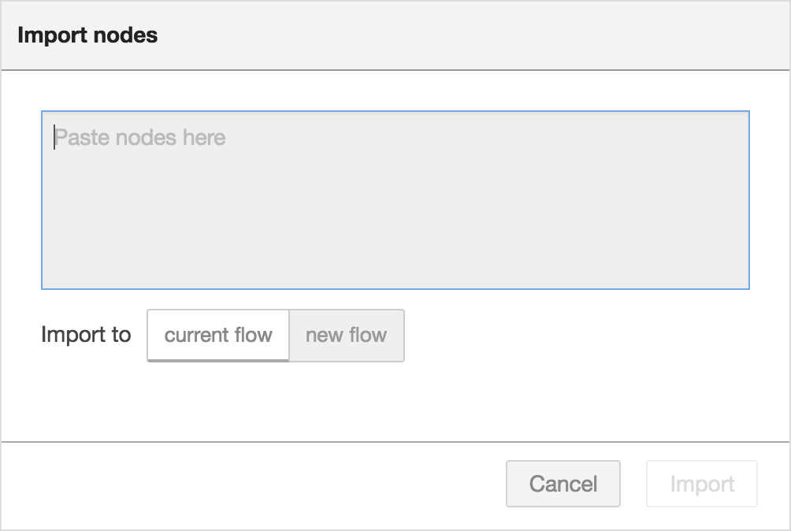
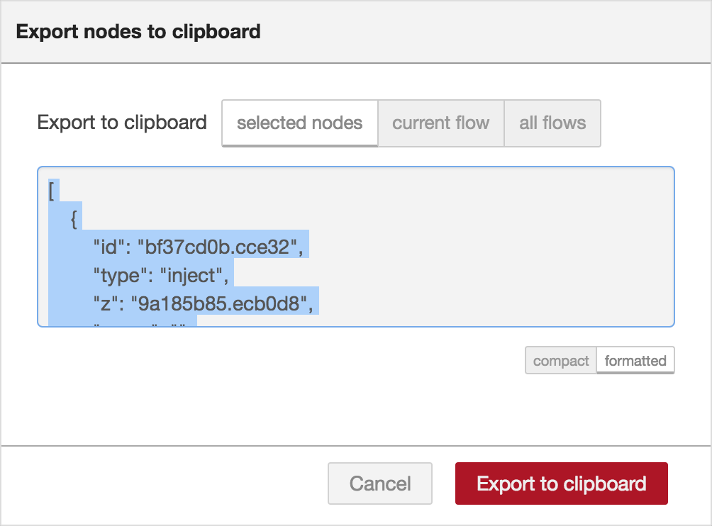

JSON形式でフローをエディタにインポートしたりエクスポートしたりすることで、
フローを非常に簡単に他の人々と共有することができます。

### フローをインポートする

  
  
フロー読み込みダイアログ

フローをインポートするには、インポートダイアログを開き、JSON形式のフローを貼り付けて「読み込み（Import）」をクリックします。

ダイアログに正常なJSONが貼り付けられたときのみ、「読み込み」ボタンがアクティブになります。

また、ダイアログでは現在のフローにノードをインポートするか、
新しいフローを作成するかを選ぶことができます。

<table class="action-ref inline">
 <tr><th colspan="2">リファレンス</th></tr>
 <tr><td>ショートカットキー</td><td><code>Ctrl/⌘-i</code></td></tr>
 <tr><td>メニューオプション</td><td><code>読み込み -&gt; クリップボード</code></td></tr>
 <tr><td>動作</td><td><code>core:show-import-dialog</code></td></tr>
</table>

 

### フローをエクスポートする

  
  
フロー書き出しダイアログ

書き出しダイアログはエディタからJSON形式のフローをコピーするために利用できます。

選択されているノード、現在のフロー（タブノードを含む）またはすべてのフロー設定を
エクスポートすることができます。

ダイアログはエクスポートするJSONフォーマットをインデントのない形式とインデント付きの形式という選択肢を提示します。
インデントのないフォーマットでは空白がなく、単一行のJSONになります。
インデント付きのフォーマットでは、読みやすいようにインデントがつけられ、複数行になります。

<table class="action-ref inline">
 <tr><th colspan="2">リファレンス</th></tr>
 <tr><td>ショートカットキー</td><td><code>Ctrl/⌘-e</code></td></tr>
 <tr><td>メニューオプション</td><td><code>書き出し -&gt; クリップボード</code></td></tr>
 <tr><td>動作</td><td><code>core:show-export-dialog</code></td></tr>
</table>
