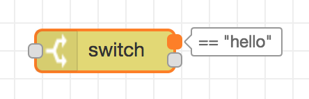
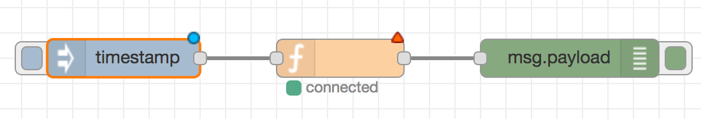
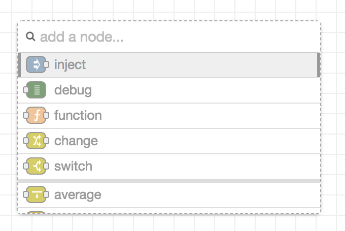
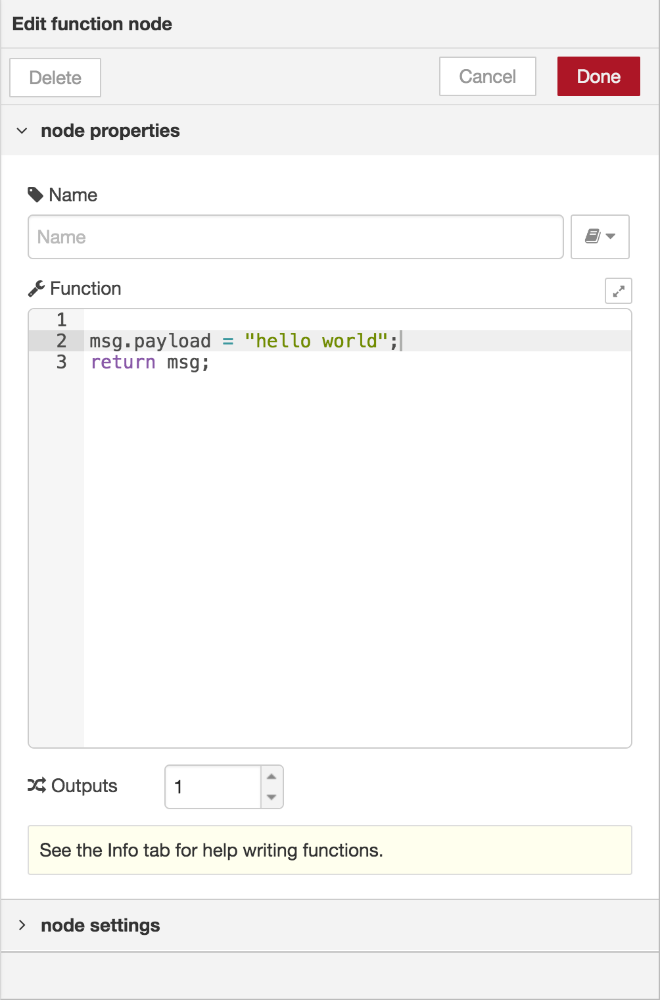
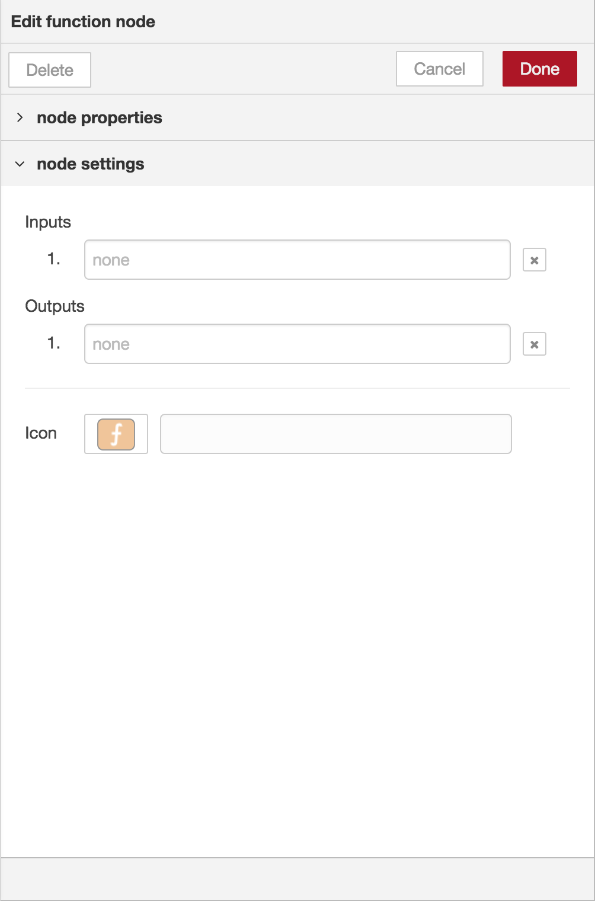
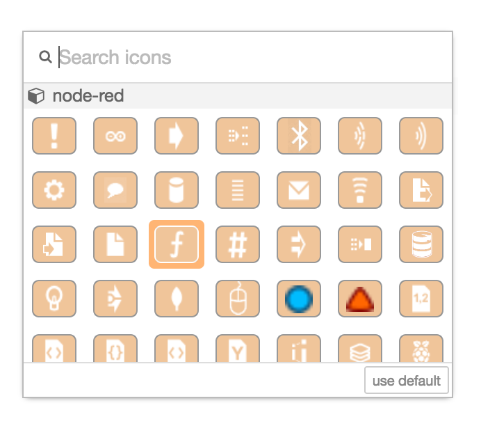
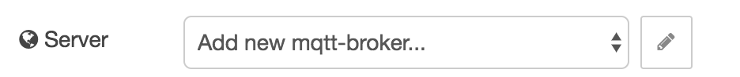
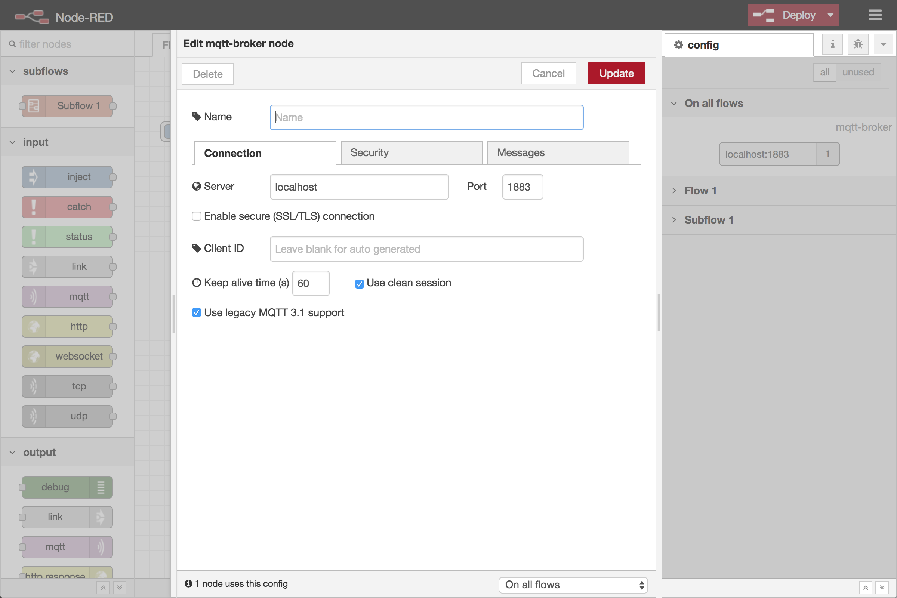

ノードは以下のような方法でワークスペースに追加できます。:

 - [パレット](../palette)からドラッグする
 - [クイック追加ダイアログ](#クイック追加ダイアログ)を利用する
 - ライブラリまたはクリップボードからインポートする

 

   
   
ノードポートラベル

 

ノード同士はポートを介してワイヤーで繋がれます。
ノードの多くは1つの入力ポートと複数の出力ポートを持っています。
ポートは、マウスをホバーした際に表示されるラベルを持っているかもしれません。
ノードはラベルを指定することができ、例えばSwitchノードはポートに対応するルールを表示します。
また、ラベルはノードの編集ダイアログでカスタマイズすることができます。

いくつかのノードは、ノードの下にステータスメッセージとアイコンを表示します。
これはノードの実行状態を示します。
例えば、MQTTノードでは現在接続しているか否かを示します。

  
  
ノードの要素

ノードにデプロイされていない変更があった場合、ノードの上に青い丸が表示されます。
ノードの設定にエラーがあった場合、赤い三角形が表示されます。

一部のノードは左端または右端にボタンを持っています。
これらはノードに何らかの作用をもたらします。
InjectノードやDebugノードはボタンを持っているコアノードです。

#### クイック追加ダイアログ

クリック追加ダイアログは、
パレットからノードをドラッグする必要なく、マウスがどこにあろうともワークスペースにノードを追加できる簡単な方法です。

  
  
クイック追加ダイアログ

ワークスペースをクリックするときに`Ctrl`または`Command`キーを押すことで、
ダイアログが開きます。

ダイアログは追加できるすべてのノード一覧を含みます。
一覧の上部には主な5つのコアノードを表示し、
その下に最近追加されたノードが続き、最後に残りのノードがアルファベット順に並びます。

パレットと同様に、
ダイアログの上部には一覧をフィルダリングし、素早くノードを発見するための入力欄があります。

#### ノードの設定を編集する

ノードの設定はノード上でダブルクリック、
またはワークスペースでフォーカスされているときに`Enter`キーを押すことで編集できます。
複数のノードが選択されている場合、選択された*最初*のノードを編集します。

  
  
  
ノード編集ダイアログ - プロパティおよび設定セクション

ノード編集ダイアログは、プロパティ（node properties）と設定（node settings）という2つの異なるセクションを持っています。
プロパティセクションには編集中のノードごとに独自の編集フォームが表示されます。
設定セクションにはすべてのノードで設定可能な共通設定が表示されます。
これにはカスタムポートラベルおよびノードのアイコンが含まれます。

アイコンをクリックするとノードのアイコンピッカーが表示され、
利用可能なアイコン一覧からこのノードに利用するアイコンを選ぶことができます。

  
  
ノードアイコンピッカー

#### Configurationノード

Configuration（config）ノードは、
フロー内の通常のノードと共有できる再利用可能な設定を持った特殊なノードです。

例えば、MQTT InノードおよびMQTT OutノードはMQTTブローカ設定ノードを利用して、
MQTTブローカーへの共有接続を表します。

Configurationノードは、Configノードを必要とするノードの編集ダイアログを介して追加されます。
必要なタイプの利用可能なConfigノードから選択するか、
新しいインスタンスを追加するためのフィールドがあります。

  
  
Configurationノードを追加する

セレクトボックスの横のボタンをクリックすることで、
選択しているノードの編集ダイアログを開く、または新しいインスタンスを追加します。

  
  
Configurationノード編集ダイアログ

Configノードはアイコンや設定するラベルがないため、
Configノード編集ダイアログはノードプロパティセクションのみ持っています。

ダイアログのフッタには、このConfigノードを利用しているノードの数が表示されます。
また、Configノードのスコープを設定するセレクトボックスも表示されます。
スコープは、このConfigノードが利用できるフローを定義します。
デフォルトではすべてのフローで利用できますが、セレクトボックスはこのスコープを1つのフローに限定することができます。

[ノードの設定サイドバー](sidebar/config)で、すべてのConfigノードの管理をおこなうことができます。
