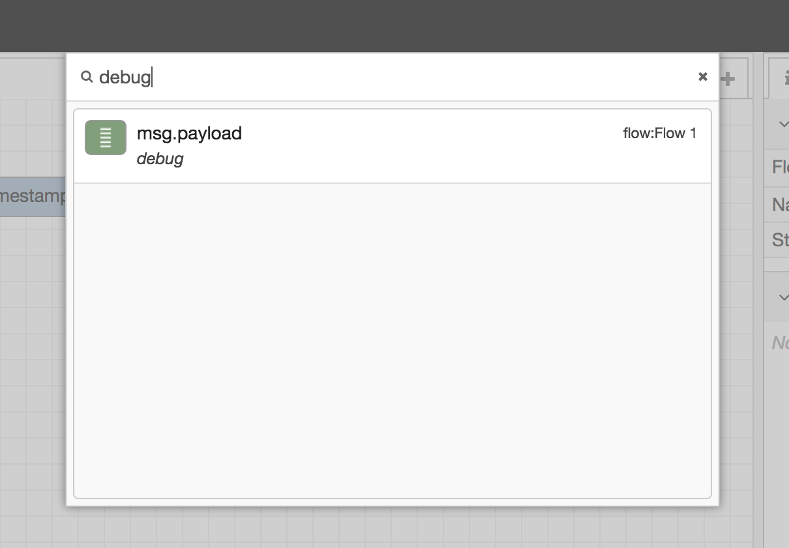

  
  
検索ダイアログ

検索ダイアログでは、
ワークスペース内のConfigurationノードを含めてノードを検索することができます。

ノードのすべてのプロパティはインデックス付けされているため、
IDや種類、その他プロパティからノードを検索できます。

結果の一覧からノードを選択することで、エディタ内のノードがわかります。

<table class="action-ref inline">
 <tr><th colspan="2">リファレンス</th></tr>
 <tr><td>ショートカットキー</td><td><code>Ctrl/⌘-f</code></td></tr>
 <tr><td>メニューオプション</td><td><code>ノードを検索</code></td></tr>
 <tr><td>動作</td><td><code>core:search</code></td></tr>
</table>
