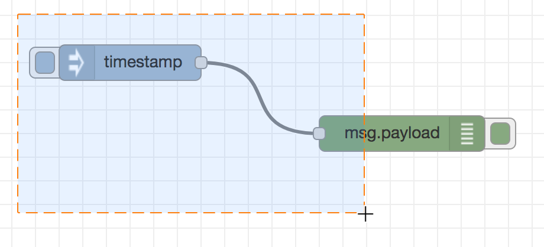

ノードはクリックすることで選択できます。
現在選択されているものはすべて選択が解除されます。
情報サイドバーはノードのプロパティとそのノードのヘルプテキストの表示を更新します。

ノードをクリックするときに`Ctrl`または`Command`キーを押した場合、
このノードが追加選択されます（または既にこのノードが選択状態であれば選択から外されます）。

ノードをクリックするときに`Shift`キーを押した場合、
このノードおよび接続しているすべてのノードが選択されます。

ワイヤーをクリックすると、ワイヤーが選択状態になります。
ノードとは異なり、一度に1つのワイヤーしか選択できません。

### なげなわツール

  
  
なげなわツールで複数のノードを選択する

なげなわツールは複数のノードを選択するために利用できます。
ワークスペースで、クリックしてからドラッグすることで利用できます。

なげなわツールでワイヤーを選択することはできません。

 

### すべてのノードを選択する

現在のフローのすべてのノードを選択するには、
ワークスペースにフォーカスがあることを確認し、`Ctrl/Command-a`を押してください。

<table class="action-ref inline">
 <tr><th colspan="2">リファレンス</th></tr>
 <tr><td>動作</td><td><code>core:select-all-nodes</code></td></tr>
 <tr><td>ショートカットキー</td><td><code>Ctrl/⌘-a</code></td></tr>
</table>

### エディタクリップボード

<table class="action-ref inline">
 <tr><th colspan="2">リファレンス</th></tr>
 <tr><td>動作</td><td><code>core:copy-selection-to-internal-clipboard</code></td></tr>
 <tr><td>ショートカットキー</td><td><code>Ctrl/⌘-c</code></td></tr>
</table>
<table class="action-ref inline">
 <tr><th colspan="2">リファレンス</th></tr>
 <tr><td>動作</td><td><code>core:cut-selection-to-internal-clipboard</code></td></tr>
 <tr><td>ショートカットキー</td><td><code>Ctrl/⌘-x</code></td></tr>
</table>
<table class="action-ref inline">
 <tr><th colspan="2">リファレンス</th></tr>
 <tr><td>動作</td><td><code>core:paste-selection-from-internal-clipboard</code></td></tr>
 <tr><td>ショートカットキー</td><td><code>Ctrl/⌘-v</code></td></tr>
</table>

エディタは標準的なコピー/切り取り/貼り付け操作をサポートしています。
システムクリップボードではなく、内部クリップボードが利用されることに注意してください。
