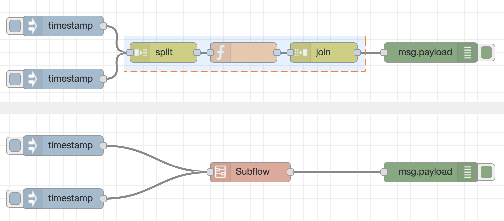

サブフローとは、ワークスペースでノードの集まりを1つのノードにまとめたものを指します。

フローの見た目の複雑さを減らすため、
または複数の場所で使用するる再利用可能なフローとしてノードのグループをまとめるために使用できます。

作成されたサブフローは利用可能なノードのパレットへ追加されます。
サブフローの個々のインスタンスは他のノードと同様にワークスペースに追加されます。

*Note:* サブフローは直接的であれ間接的であれ、それ自身のインスタンスを含むことができません。

### 空のサブフローを作成する

サブフローは、メニューで「サブフロー -> サブフローを作成」オプションを選択することで作成できます。
これは空のサブフローを作成し、ワークスペースでサブフローを展開します。

<table class="action-ref inline">
 <tr><th colspan="2">リファレンス</th></tr>
 <tr><td>ショートカットキー</td><td><i>なし</i></td></tr>
 <tr><td>メニューオプション</td><td><code>サブフロー -&gt; サブフローを作成</code></td></tr>
 <tr><td>動作</td><td><code>core:create-subflow</code></td></tr>
</table>

### ノードをサブフローに変換する

現在選択しているノードを、
メニューから「サブフロー -> 選択部分をサブフロー化」オプションを選択することでサブフローに変換することもできます。
このノードは新しいサブフローへと移動し、
フローではサブフローインスタンスノードに置換されます。

  
  
サブフローを作成する

  
  
不正なサブフロー選択

サブフローへの変換は選択範囲に入ってくるワイヤーが1つのノードに接続されている場合のみ可能です。
結果としてサブフローノードは最大1つの入力を持つことができます。

 

<table class="action-ref inline">
 <tr><th colspan="2">リファレンス</th></tr>
 <tr><td>ショートカットキー</td><td><i>なし</i></td></tr>
 <tr><td>メニューオプション</td><td><code>サブフロー -&gt; 選択部分をサブフロー化</code></td></tr>
 <tr><td>動作</td><td><code>core:convert-to-subflow</code></td></tr>
</table>

### サブフローを編集する

サブフローを開いて内容を編集するには2つの方法があります。
パレットでこのノードをダブルクリックする、
またはサブフローインスタンスノードの編集ダイアログで「フローのテンプレートを編集」ボタンをクリックします。

ワークスペースでサブフローは新しいタブとして開かれます。
一般的なフローのタブとは異なり、サブフロータブは閉じて非表示にすることができます。

  
  
サブフローを編集する

#### 入出力

サブフローの入出力は、
通常どおりフローに繋げることができる灰色の正方形のノードで表示されます。

ツールバーには、これらのノードを追加および削除するためのオプションがあります。
通常のフローノードと同様に、最大1つの入力と必要な数の出力があります。

#### サブフロープロパティ

  
  
サブフロープロパティ編集ダイアログ

「プロパティを編集」ボタンはサブフロープロパティ編集ダイアログを開きます。
フロープロパティ編集ダイアログでは、サブフローの名称と詳細を設定することができます。

サブフローが現れるカテゴリーも設定することができ、
既存のカテゴリから選択するか新規のカテゴリを追加します。

#### サブフローを削除する

サブフローツールバーの「サブフローを削除」ボタンは、
サブフローとその*すべて*のインスタンスノードを排除するために利用できます。
