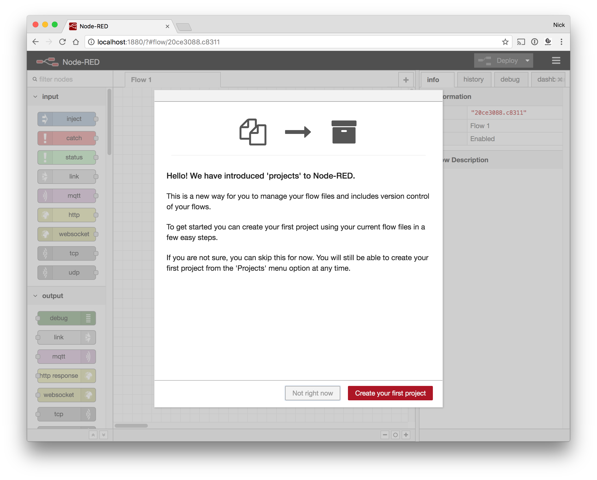

 - [プロジェクトを導入する](#プロジェクトを導入する)
 - [プロジェクトを有効化する](#プロジェクトを有効化する)
 - [はじめてのプロジェクト作成](#はじめてのプロジェクト作成)
 - [プロジェクトを利用する](#プロジェクトを利用する)
   - [プロジェクト設定にアクセスする](#プロジェクト設定にアクセスする)
     - [プロジェクトの依存関係](#プロジェクトの依存関係)
     - [プロジェクトの設定](#プロジェクトの設定)
   - [バージョン管理](#バージョン管理)
     - [ローカルの変更](#ローカルの変更)
     - [コミット履歴](#コミット履歴)
   - [新規プロジェクトを作成する](#新規プロジェクトを作成する)
     - [プロジェクトを開く](#新規プロジェクトを作成する)
     - [プロジェクトを作成](#プロジェクトを作成)
     - [プロジェクトをクローン](#プロジェクトをクローン)

### プロジェクトを導入する

プロジェクトはフローファイルを管理する新しい方法です。
フローを単純なファイルのペアとして扱うのではなく、
再配布可能なNode-REDアプリケーションを作成するために必要なすべてとします。

この方法はGitリポジトリによって支えられています。
つまり、すべてのファイルは完璧なバージョン管理がなされ、開発者は慣れ親しんだワークフローを使用して他のユーザーと共同作業できます。

0.18版のリリースでは、プロジェクト機能は試行段階です。
よって、設定ファイル内で有効化する必要があります。

*この機能は現在IBMクラウド環境では利用できません。*

### プロジェクトを有効化する

プロジェクト機能を有効化するためには、
自身の`settings.js`ファイルを編集し、`module.exports`ブロックに以下のオプションを追加、Node-REDを再起動します。

<div class="doc-callout">
<em>Note</em> :  <code>settings.js</code>ファイルは<em>JavaScriptオブジェクト</em>を出力します。
Node-REDを設定するには、
以下の<code>editorTheme</code>のようにキー/バリューペアを新規追加または既存のペアの編集する必要があり、JavaScriptオブジェクトの編集方法を理解しなければなりません。
</div>

```
   editorTheme: {
       projects: {
           enabled: true
       }
   },
```

この機能は`git`および`ssh-keygen`コマンドラインツールが利用可能であることに依存します。
Node-REDは起動時にそれらを確認し、見つからなかった場合には通知をおこないます。

### はじめてのプロジェクト作成

エディタを開くと初期画面が表示され、
既存のフローファイルを利用したはじめてのプロジェクト作成を勧められます。



以下のステップを通じて、プロジェクトを作成します。:

1. **バージョン管理クライアントを設定する**

    Node-REDはバージョン管理にオープンソースツールであるGitを利用します。
    これはプロジェクトファイルの変更を追跡し、リモートリポジトリへのプッシュを可能にします。

    一連の変更をコミットすると、Gitはユーザ名とEmailアドレスによって誰が変更をおこなったのかを記録します。
    ユーザー名はあなたが望むものなら何でも構いません。
    本名である必要はありません。

    既にGitクライアントを設定しているかもしれません。
    この場合、Node-REDはその設定を再利用します。

    これらの設定はNode-RED設定ダイアログからいつでも変更できます。

    - [Gitクライアント設定に関する追加情報](https://help.github.com/articles/set-up-git/#setting-up-git) (GitHub)

2. **プロジェクトを作成する**

    次のステップではプロジェクトに名前を付け、説明を設定します。

3. **プロジェクトファイルを作成する**

    Node-REDは既存のフローファイルをプロジェクトへ自動的に移行します。
    必要に応じて、ここで名称を変更することができます。

4. **認証情報ファイルの暗号化を設定する**

    GitHubのような公開サイトでプロジェクトを共有する際、
    認証情報ファイルを暗号化することを*強く*推奨します。

    暗号化には、ファイルを保護するために利用するキーを選択する必要があります。
    このキーはプロジェクト内に保管されません。
    他の誰かがプロジェクトをクローンした場合、その人に認証情報ファイルを解読するためのキーを提供する必要があります。
    それ以外の場合、その人自身の認証情報を提供するためにフローを編集する必要があります。

プロジェクトは以下のディレクトリに作成されます。: `~/.node-red/projects/<project-name>`

### プロジェクトを利用する

プロジェクトを作成したら、
いつもどおりNode-REDエディタの利用を続けられます。
エディタには、プロジェクトを利用するために追加された新しい部分がいくつかあります。

#### プロジェクト設定にアクセスする

情報サイドバーの上部に、現在どのプロジェクトに取り組んでいるかが表示されます。
プロジェクト名の横には、プロジェクト設定ダイアログを開くボタンがあります。


また、
メインメニューの`プロジェクト -> プロジェクト設定`オプションからもアクセスすることができます。

ダイアログは3つのタブを保持しています。:

 - プロジェクト - プロジェクトのREADME.mdファイルを編集できます
 - [依存関係](#project-dependencies) - プロジェクトが依存しているnodeモジュールの一覧を管理します
 - [設定](#project-settings) - Gitリモートを含むプロジェクト設定を管理します

##### プロジェクトの依存関係

各プロジェクトはそれぞれの`package.json`ファイルを持っており、
これにはプロジェクトが依存しているノードモジュールの一覧が含まれています。
Node-REDエディタはフローで使用しているノードを追跡し、依存関係の一覧を最新に保ちます。

 

上記のスクリーンショットでは、現在のプロジェクトが`package.json`ファイルでリスト化された3つのモジュールを持っており、
それぞれは以下のように異なる状態になっています。:

 - `node-red-node-mysql`は現在インストールされていません
 - `node-red-node-random`は現在のフローで利用されています
 - `node-red-node-rbe`はリストに含まれていますが、現在のフローでは利用されていません

最後に`node-red-node-smooth`は現在のフローで利用されているノードを提供していますが、
このモジュールは依存関係として一覧に含まれていません。

プロジェクトを他者と共有したい場合、依存関係一覧を最新に保つことは重要です。
なぜならば、この一覧は必要なモジュールのインストールを手助けするからです。

##### プロジェクトの設定

プロジェクト設定タブではフローファイルおよび認証情報の暗号化設定の管理、
ローカルGitブランチおよびリモートリポジトリの設定をおこなうことができます。

#### バージョン管理

サイドバーに新しく`履歴（history）`タブが追加されました。
ここではプロジェクトのバージョン管理をおこないます。このタブは2つのセクションがあります。:


 - ローカルの変更 - 変更されたプロジェクトファイルを表示し、
   ステージングとコミットを可能にします。
 - コミット履歴 - リポジトリ内の全コミットの一覧で、
   コミットをリモートリポジトリへプッシュできます。

##### ローカルの変更


新しいフロー設定をデプロイした場合などプロジェクトファイルが変更される度に、「ローカルファイル（Local files）」セクションにファイルが一覧表示されます。
ファイル名をクリックすることで変更箇所の差分を確認できます。
ファイル上にマウスをホバーさせると、**+**ボタンが表示されます。
これをクリックしてファイルをステージングし、
「コミット対象とする変更（Changes to commit）」リストに移動させます。

コミットしたいファイルをステージングしたあと、
`コミット（commit）`ボタンをクリック、メッセージを入力し、確定します。

<br style="clear:both">

##### コミット履歴


コミット履歴（Commit History）セクションはリポジトリの現在のブランチの全コミット一覧を表示します。
プロジェクトを作成したとき、
Node-REDはプロジェクトの初期のデフォルトファイルを自動的にコミットします。

リスト上部に「ブランチ（Branch）」ボタンがあります。
これはリポジトリ内でブランチのチェックアウト/作成を可能にします。
また、追跡のためにリモート/ブランチを確認し、
リモートに対して変更をプッシュ/プルすることを可能にします。

Node-REDエディタはシンプルなユーザ体験を提供しようとしており、
Gitの提供する様々なオプションすべてを公開しないようにしています。
この点についてフィードバックを歓迎しています。
例えば、ここではローカルコミットのリベースやリモートへの強制プッシュといったオプションを提供していません。
しかしながら、これらはコマンドラインによって実行することができます。

<br style="clear:both">

#### 新規プロジェクトを作成する

既存のフローファイルから移行して最初のプロジェクトファイルを作成したあと、
追加してプロジェクトを作成することが可能です。

メニューから`プロジェクト -> 新規`を選択肢、プロジェクトダイアログを開きます。

このダイアログは3つの選択肢を表示します。:

 - プロジェクトを開く
 - プロジェクトを作成
 - プロジェクトをクローン

##### プロジェクトを開く

Node-REDは常時1つのプロジェクトのみを実行します。
別のプロジェクト開くと、実行するフローを変更することになります。

「プロジェクトを開く」画面では、一覧でプロジェクト上にマウスホバーし、削除ボタンをクリックすることでプロジェクトを削除することができます。
現在利用しているプロジェクトを削除することはできません。

##### プロジェクトを作成

新規プロジェクトの作成をおこないます。
「はじめてのプロジェクト作成」での一連の画面と同じ選択肢が表示されますが、ここでは1つの画面にまとめられています。

##### プロジェクトをクローン

既存リモートリポジトリのクローンをおこないます。
リポジトリの`http(s)`または`git/ssh` URLを利用することができます。
リポジトリに認証が必要な場合、ここで認証情報を入力する必要があります。

*Note:* `http` URLでは、URL自体にユーザ名およびまたはパスワードを含ませないでください。
これらは入力を促されたときに別々に入力すべきです。

*Node-REDはあなたがGitクライアントに設定しているかもしれない如何なる認証情報ヘルパーも現在利用していません。
この部分はコミュニティからのフィードバックを求めています。*

`git/ssh`では、Node-REDは利用可能はssh公開鍵の一覧を提供します。
この一覧は、対応する秘密鍵ファイルを持つ末尾が`.pub`ファイルを、`~/.ssh`のスキャンすることによって作成します。
また、メイン設定ダイアログの「Git設定」タブから公開鍵/秘密鍵ペアを新規作成することもできます。
これらのファイルは`~/.node-red/projects/.sshkeys/`下に保管されます。
`adminAuth`を有効化した場合、
このファイルのスコープは現在ログインしているユーザに限定され、
リモートの認証情報を共有する必要がなくなります。
